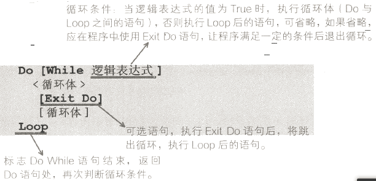
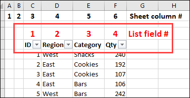
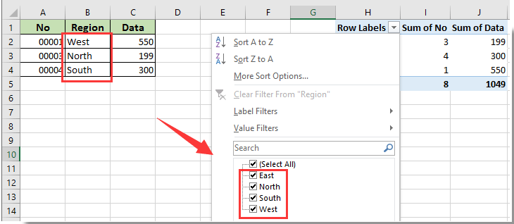
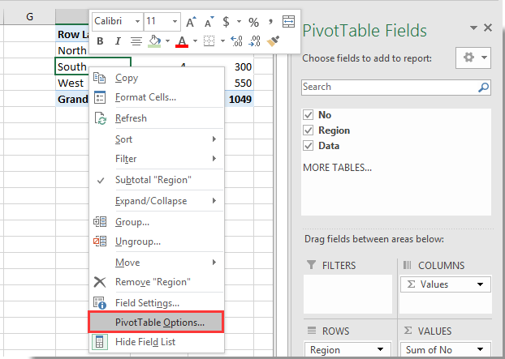
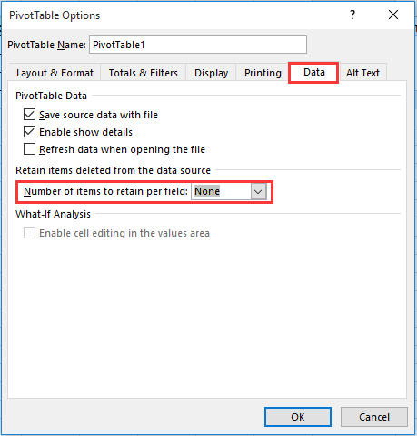
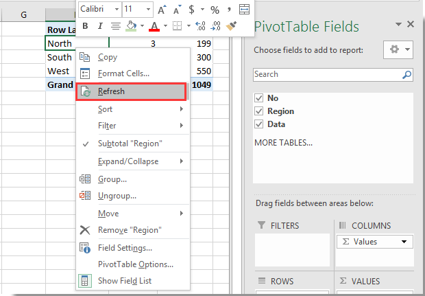
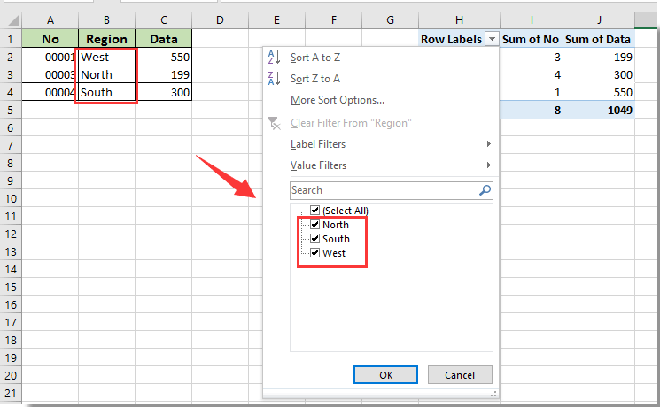
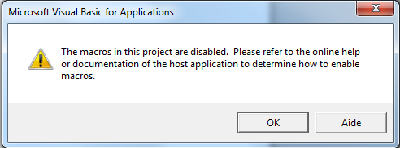
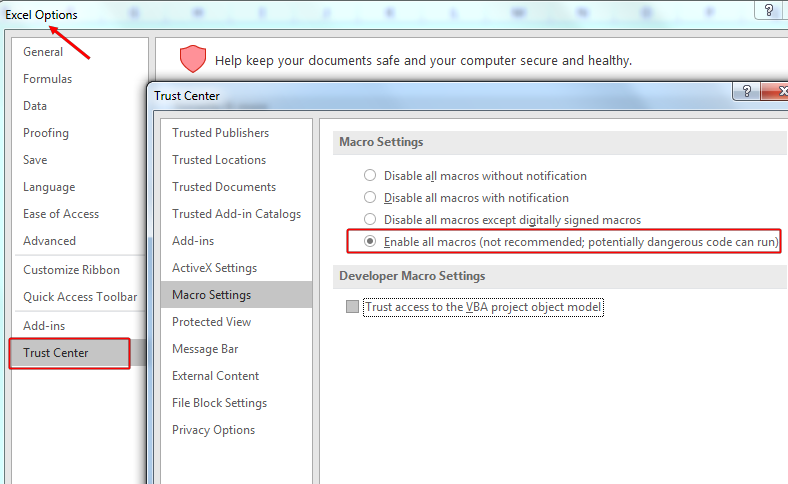

# 简明Excel VBA
Last update date：07/Apr/2020 17:10


## 目录

- [x] [0x01 语法说明](#explanation) (done)
    - [1.1 数据和数据类型](#1.1)
    - [1.2 常量和变量](#1.2)
    - [1.3 数组](#1.3)
    - [1.4 运算符](#1.4)
    - [1.5 语句结构](#1.5)
        - [1.5.1 选择语句](#1.5.1)
        - [1.5.2 循环语句](#1.5.2)
        - [1.5.3 GoTo语句](#1.5.3)
    - [1.6 过程(Sub)和函数(Function)](#1.6)
    - [1.7 正则表达式(Regular Expression)](#1.7)
    - [1.8 注释（Comments code）](#1.8)
    - [1.9 补充](#1.9)
    - [1.10 示例](#1.10)
- [x] [0x02 VBA界面介绍](#layout) (done)
    - [2.1 整体界面说明](#2.1)
    - [2.2 工程资源管理器（Project Explore）说明](#2.2)
    - [2.3 设置VBA Macro Project 密码保护](#2.3)
    - [2.4 常用快捷栏及窗口设置](#2.4)
- [x] [0x03 对象操作说明](#object-option) (done)
    - [3.1 对象简述](#3.1)
    - [3.2 Application对象](#3.2)
- [x] [0x04 字符串 String 相关常用操作](#string-option) (done)
    - [4.1 Trim](#4.1)
    - [4.2 Instr 和 InStrRev (类似indexOf函数)](#4.2)
    - [4.3 Mid (类似substring函数)](#4.3)
    - [4.4 Left 和 Right](#4.4)
    - [4.5 Replace](#4.5)
    - [4.6 StrReverse 倒转函数](#4.6)
    - [4.7 其他字符串函数](#4.7)
- [ ] [0x05 Excel 相关常用操作](#excel-option) (doing)
    - [5.1 Excel 基础操作](#5.1)
    - [5.2 打开Excel两种方式](#5.2)
    - [5.3 操作Excel工作表（Worksheet）](#5.3)
    - [5.4 Excel AutoFilter / Excel 自动筛选操作](#5.4)
    - [5.5 清理Excel数据相关操作](#5.5)
- [x] [0x06 文件 相关常用操作](#0x06) (done)
    - [6.1 判断文件，文件夹等是否存在](#6.1)
    - [6.2 文件相关操作](#6.2)
    - [6.3 文件夹相关操作](#6.3)
    - [6.4 其他操作（获取文件名等）](#6.4)
- [x] [0x07 VBA Best Practices](#0x07) (English Version)
- [ ] [0x08 Trouble shooting](#0x08) (doing)
    - [8.1 消除Excel保存时警告（Privacy Warning:this document contains macros...）](#8.1)
    - [8.2 清除Excel数据透视表中过滤器缓存（旧项目）](#8.2)
    - [8.3 解决办法：The macros in this project are disabled. Please refer to ...](#8.3)
    - [8.4 解决办法：添加一个宏文件(第三方插件)到快速访问栏](troubleshootings/Macro2QuickToolBar.md)
    - [8.5 解决办法：如何修改编辑一个.xlam文件/解决保存修改后的.xlam文件再次内容消失问题](troubleshootings/EditXlamFile.md)
    - [8.6 解决办法：使用SaveAs方法保存.xlsx后，再次打开提示: 文件损坏,后缀名错误（格式错误）](troubleshootings/SaveAsIssue.md)
- [x] [0x09 VBA示例代码](#0x09) (done)
- [ ] [0x10 Excel-VBA 快捷键](#0x10) (doing)
- [x] [0x11 Excel-VBA Debug调试](Debug.md) (done)
- [x] [0xFF 学习资源列表](#docslist) (done)


<a name="explanation"></a>
## 0x01 语法说明

都知道学会了英语语法，再加上大量的词汇基础，就算基本掌握了英语了。
类似的要使用vba，也要入乡随俗，了解他的构成，简单的说vba包含`数据类型`、
`变量`/`常量`、`对象`和常用的`语句结构`。

不过呢在量和复杂度上远低于英语，不用那么痛苦的记单词了，所以vba其实很简单的。
熟悉了规则之后剩下就是查官方函数啦，查Excel提供的可操作对象啦。

顺带一提的是，函数其实也很容易理解，方便使用。拿到一个函数，例如`Sum`，
只要知道它是求多个数的和就够了，剩下的就是用了。例如`Sum(1000,9)`结果就是`1009`了。
函数的一大好处就是隐藏具体实现细节，提供简洁的使用方法。

<a name="1.1"></a>
### 1.1 数据和数据类型

Excel里的每一个单元格都是一个`数据`，无论是数字、字母或标点都是数据。
对数据排排队，吃果果，对不同的数据扔到不同的篮子里归类，篮子就是`数据类型`了。

在Excel-vba中，`数据类型`只有`数值`、`文本`、`日期`、`逻辑`或`错误`五种类型。
前四种最为常用。具体描述参见下表：


| 类型 | 类型名称 | 范围 | 占用空间|声明符号 | 备注|
|--------|-------|-----|--------|-----|----|
| **逻辑型**|
| 布尔 | Boolean|逻辑值True或False|2|
|**数值型**|
|字节| Byte | 0~255的整数|1|
|整数| Integer| -32768~32767|2|%|
|长整数|Long|-2147483648~2147483647|4|&|
|单精度浮点|Single||4|!|
|双精度浮点|Double||4|#|
|货币|Currency||8|@|
|小数|Decimal||14|
|**日期型**|
|日期|Date|日期范围:100/1/1~9999/12/31|8|
|**文本型**|
|变长字符串|String|0~20亿||$|
|定长字符串|String|1~65400||
|**其他**|
|变体型|Variant(数值)|保存任意数值，也可以存储Error,Empty,Nothing,Null等特殊数值|
|对象|Object|引用对象|4|

表1.1 VBA数据类型

补充一点是，数组就像一筐水果，里面可以存不止一个数据。
他不是一个具体的数据类型，叫数据结构更合适些。

<a name="1.2"></a>
### 1.2 常量和变量

定义后不能被改变的量，就是`常量`；相反的`变量`就能修改具体值。

在vba里，使用一个 变量/常量 要先声明。

`常量`声明方法如下：</br>
` Const 常量名称 As 数据类型 = 存储在常量中的数据`
例如：
```vba
Const PI As Single = 3.14 ' 定义一个浮点常量为PI，值为3.14
```

`变量`声明方法如下：</br>
```vba
Dim 变量名 As 数据类型
```
变量名，必须**字母**或**汉字**开头，**不能** 包含空格、句号、感叹号等。

数据类型，对应上面 ↑　表1.1里的那些

更多的声明方法，跟`Dim`声明的区别是作用范围不同：
```vba
Private v1 As Integer   ' v1为私有整形变量
Public v2 As String     ' v2为共有字符串变量
Static v3 As Integer    ' v3为静态变量，程序结束后值不变

' 变量声明之后，就可以赋值和使用了
v1 = 1009
v2 = "1009"
v3 = 1009

' 使用类型声明符，可以达到跟上面同样的效果
public v2$  ' 与 Public v2 As String 效果一样

' 声明变量时，不指定具体的类型就变成了Variant类型，根据需要转换数据类型
Dim v4
```

<a name="1.3"></a>
### 1.3 数组

使用数组和对象时，也要声明，这里说下数组的声明：
```vba
' 确定范围的数组，可以存储b - a + 1个数，a、b为整数
Dim 数组名称(a To b) As 数据类型

Dim arr(1 TO 100) As Integer ' 表示arr可以存储100个整数
arr(100) '表示arr中第100个数据

' 不指定a，直接声明时，默认a为0
Dim arr2(100) As Integer ' 表示arr可以存储101个整数,从0数
arr2(100) '表示arr2中第101个数据

' 多维数组
Dim arr3(1 To 3,1 To 3,1 To 3) As Integer ' 定义了一个三维数组，可以存储3*3*3=27个整数

' 动态数组，不确定数组大小时使用
Dim arr4() As Integer   ' 定义arr4为整形动态数组
ReDim arr4(1 To v1)     ' 设定arr4的大小，不能重新设定arr4的类型

```

除了用`Dim`做常规的数组的声明，还有下面这些声明数组的方式:
```vba
' 使用Array函数将已知的数据常量放到数组里
Dim arr As Variant        ' 定义arr为变体类型
arr = Array(1, 1, 2, 3, 5, 8, 13, 21) ' 将整数存储到arr中,索引默认从0开始

' 使用Split函数分隔字符串创建数组
Dim arr2 As Variant
arr2 = Split("hello, world", ", ") ' 按,分隔字符串 hello,world 并赋值给arr2

' 使用Excel单元格区域创建数组
' 这种方式创建的数组，索引默认从1开始
Dim arr3 As Variant
arr3 = Range("A1:C3").Value   ' 将A1:C3中的数组存储到arr3中
Range("A4:C6").Value= arr3    ' 将arr3中的数据写入到A4:C6中的区域
```


**数组常用的函数**

|函数|函数说明|参数说明|示例|
|----|----|----|----|
|`UBound(Array arr, [Integer i])`|数组最大的索引值|`arr`：数组；`i`：整形，数组维数|
|`LBound(Array arr, [Integer i])`|数组最小的索引值|同上|
|`Join(Array arr, [String s])`|合并字符串|`arr`：数组；`s`：合并的分隔符|
|`Split(String str, [String s])`|分割字符串|`str`：待分割的字符串；`s`：分割字符串的分隔符|

函数说明

UBound(Array arr,[Integer i]);</br>
UBound为函数名</br>
arr和i 为UBound的的参数，用中括号括起来的表示i为非必填参数</br>
arr和i 之前的Array，Integer表示对应参数的数据类型</br>

> 补充
> [VBA 内置函数列表](https://msdn.microsoft.com/zh-cn/library/office/jj692811.aspx)


<a name="1.4"></a>
### 1.4 运算符

运算符的作用是对数据进行操作，像加减乘除等。这块不再具体说明，列一下vba中常用的运算符。

|运算符|作用|示例|
|----|----|----|
|**算术运算符**|
|+|求两个数的和|
|-|求两个数的差|
|*|求两个数的乘积|
|/|求两个数的商|
|`\`|求两个数相除后所得商的整数|
|^|求一个数的某次方|
|Mod|求两个数相除后所得的余数| 10 Mod 9=1|
|**比较运算符**|
|=|比较两个数据是否相等|相等返回 True;否则返回False|
|<>|不相等|
|<|小于|
|>|大于|
|<=|不大于|
|>=|不小于|
|Is|比较连个对象的引用关系|
|Like|比较两个字符串是否匹配| String1 Like String2|
|**文本运算符**|
|+|连接两个字符串|
|&|连接两个字符串|
|**逻辑运算符**|
|And|逻辑与|
|Or|逻辑或|
|Not|逻辑非|
|Xor|逻辑抑或|`表达式1 Xor 表达式2`两个表达式返回的值不相等时为True|
|Eqv|逻辑等价|`表达式1 Eqv 表达式2`两个表达式返回的值相等时为True|
|Imp|逻辑蕴含|

```vba
' Like是个比较有用的运算符，常用来做匹配或模糊匹配。
' 在模糊匹配的时候，有一些通配符能方便模糊匹配规则的书写
"这是一个demo1" Like "*demo1" = True    ' * 号表示匹配任意多个字符
"这是一个demo2" Like "????demo2" = True ' ? 号表示匹配任意单个字符
"这是一个demo3" Like "*demo#" = True    ' # 号表示匹配任意数字
```


#### 三目运算符

正常在VBA中没有类似java的 `expression ? true : false` 写法，但是可以使用 `IFF` 来代替：
```vba
x = IIF(expression, A, B）
x = IIF(条件, 如果成立A赋值给X, 如果不成立B赋值给X）
```

作用也等同于如下：
```
If ... Then
Else
End If
```


<a name="1.5"></a>
### 1.5 语句结构

程序通常都是顺序依次执行的。语句结构用来控制程序执行的步骤，
一般有**选择**语句、**循环** 语句。

<a name="1.5.1"></a>
#### 1.5.1 选择语句

选择语句用来判断程序执行那一部分代码

语法：If ... Then ... End If</br>
If选择可以嵌套使用</br>

常用的三种形式：

1. 普通模式
```vba
If 10 > 3 Then
    操作1  ' 执行这一步
End If

' 增加Else和Else If逻辑
If 1 > 2 Then
    操作1
ElseIf 1 = 2 Then
    操作2
Else
    操作3  ' 执行这一步
End If
```

2. 嵌套If语句
```vba
If 10 > 3 Then
    If 1 > 2 Then
        操作1
    Else
        操作2  ' 执行这一步
    End If
Else
    操作3
End If
```

3. Select ... Case ... 多选一，类似于java中的 Switch ... Case ... 语句
```vba
Dim Length As Integer
Length = 10
Select Length
    Case Is >= 8
        操作1  ' 执行这一步
    Case Is > 20
        操作2
    Case Else
        操作3
End Select
```
sample code:

```vba
Private Sub switch_demo_Click()
    Dim MyVar As Integer
    MyVar = 1

    Select Case MyVar
        Case 1
            Debug.Print "The Number is the Least Composite Number"
        Case 2
            Debug.Print "The Number is the only Even Prime Number"
        Case 3
            Debug.Print "The Number is the Least Odd Prime Number"
        Case Else
            Debug.Print "Unknown Number"
    End Select
End Sub
```

<a name="1.5.2"></a>
#### 1.5.2 循环语句

循环语句用来让程序重复执行某段代码

1. 普通For ... Next循环</br>
语法：For 循环变量 = 初始值 To 终值 Step 步长</br>
注：在VBA循环中可以使用`Exit`关键字来跳出循环，类似于Java中的break，
在for循环中语法为：`Exit For`，在do while循环中为：`Exit Do`，也可以利用`GoTo`语句
跳出本次循环，详见：[1.5.3 GoTo语句](#1.5.3)</br>
```vba
Dim i As Integer
For i = 1 To 10 Step 2 ' 设定i从1到10，每次增加2，总共执行5次
    操作1   ' 可以通过设定 Exit For 退出循环
Next i
```

2. For Each ... 循环</br>
语法：For Each 变量 In 集合或数组
```vba
Dim arr
Dim i As Integer
arr = Array(1, 2, 3, 4, 5)
For Each i In arr ' 定义变量i，遍历arr数组
    操作1
Next i
```

3. Do ... While循环</br>
语法：</br>
- 前置循环条件：</br>


- 后置循环条件：</br>


Sample code:
```vba
Dim i As Integer
i = 1
Do While i < 5  ' 循环5次
    i = i + 1
Loop

' ===============================================
' 将判断条件后置的Do...While
Dim i As Integer
i = 1
Do
    i = i + 1
Loop While i < 5 ' 循环4次
```

4. Do Until 直到...循环</br>
语法：</br>
Do Until 表达式    表达式为真时跳出循环
```vba
Dim i As Integer
i = 5
Do Until i < 1  
    i = i - 1
Loop

' ===============================================
' 后置的Do Until
Dim i As Integer
i = 5
Do
    i = i - 1
Loop Until i < 1  
```

<a name="1.5.3"></a>
#### 1.5.3 GoTo语句

**GoTo**
无条件地分支直接跳转到过程中指定的行。

**注：** GoTo语句大多用于错误处理时，但会影响程序结构，增加阅读和代码调试难度，
除非必要时，应尽量避免使用GoTo语句。

```vba
Sub TestGoTo

    Dim lngSum As Long, i As Integer
    i = 1

JUMPX:
    i = i + 1
    If i <= 100 Then GoTo JUMPX
    Debug.Print "1到100的自然数之和是：" & lngSum

End Sub
```

**CONTINUE**

循环中实现continue操作，类似java语言的continue直接跳出本次循环
```vba
Sub continueTest()
    Dim i

    For i = 0 To 5
        If i = 1 Then
            '// 跳转到CONTINUE部分
            GoTo CONTINUE
        ElseIf i = 3 Then
            '// 跳转到CONTINUE部分
            GoTo CONTINUE
        End If

        '//没有GoTo语句的时候打印counter: i
        Debug.Print i

CONTINUE:   '// countinue跳转块，可以写逻辑，如果没有逻辑就直接进行下次循环
    Next

End Sub
```

`选择`和`循环`提供了多种实现同一目的的语句结构，他们都能实现同样的作用，
差别一般是初始条件。还有书写的复杂度。正确的选择要使用的语句结构，
代码逻辑上会更清楚，方便人的阅读。

**简写**

在操作对象的属性时常常要先把对象调用路径都写出来，用`with`可以简化这一操作
```vba
' 简化前
WorkSheets("表1").Range("A1").Font.Name="仿宋"
WorkSheets("表1").Range("A1").Font.Size=12
WorkSheets("表1").Range("A1").Font.ColorIndex=3

' 使用`With`
With WorkSheets("表1").Range("A1").Font
    .Name = "仿宋"
    .Size = 12
    .ColorIndex =3
End With
```

<a name="1.6"></a>
### 1.6 过程(Sub)和函数(Function)

概述Sub和Function的区别：   

**Sub** 和 **Function** 是VBA提供的两种封装体。
* 利用宏录制得到的就是`Sub`。
* `Sub` 定义时无需定义返回值类型，而 `Function` 一般需要用 “As 数据类型” 定义函数返回值类型。
* `Sub` 中没有对过程名赋值的语句，而 `Function` 中有对函数名赋值的语句，一般在函数最后返回值，格式如下：
```vba
Set functionName = xxxxxx
```
* 调用过程：调用 Sub 过程与 Function 过程不同。调用 Sub 过程的是一个独立的语句，而调用函数过程只是表达式的一部分。另外，自定义函数并不允许修改工作表和单元格格式 (A UDF will only return a value it won't allow you to change the properties of a cell/sheet/workbook. )。但是，与 Function 一样，Sub 也可以修改传递给它们的任何变量的值。
* 调用 Sub 过程有三种方法：   [参见1.6.1](#1.6.1)   

~~ 以下两个语句都调用了名为 ProcExcel 的 Sub 过程。~~

  ~~Call  ProcExcel (FirstArgument, SecondArgument) '使用Call关键字调用~~   
  ~~ProcExcel  FirstArgument, SecondArgument        '直接调用~~   
  ~~Application.Run "ProcExcel" FirstArgument, SecondArgument~~   


~~**注意** ：当使用 Call 语法时，**参数必须在括号内**。若省略 Call 关键字，则也必须省略参数两边的括号。~~


<a name="1.6.1"></a>
#### 1.6.1 Sub 过程
```vba
[Private|Public] [Static] Sub 过程名([参数列表 [As 数据类型]])
    [语句块]
End Sub
' [Private|Public]定义过程的作用范围
' [Static]定义过程是否为静态
' [参数列表]定义需要传入的参数
```

调用`Sub`的方法有三种，使用 `Call`、<u>直接调用</u>和使用 `Application.Run`:

举个例子：


**注意** ：当使用 Call 语法时，**参数必须在括号内**。若省略 Call 关键字，则也必须省略参数两边的括号。

#### 1.6.2 Function 函数

vba内部提供了大量的函数，也可以通过`Function`来定义函数，实现个性化的需求。
```vba
[Public|private] [Static] Function 函数名([参数列表 [As 数据类型]]) [As 数据类型]
    [语句块]
    [函数名=过程结果]
End Function
```
使用函数完成上面的例子：


**参数传递**

参数传递的方式有两种，引用和传值。
传值，只是将数据的内容给到函数，不会对数据本身进行修改。
引用，将数据本身传给函数，在函数内部对数据的修改将同样的影响到数据本身的内容。

参数定义时，使用`ByVal`关键字定义传值，子过程中对参数的修改不会影响到原有变量的内容。
默认情况下，过程是按引用方式传递参数的。在这个过程中对参数的修改会影响到原有的变量。
也可以使用`ByRef`关键字显示的声明按引用传参。
```vba
Sub St1(ByVal n As Integer, ByRef range)
    ...Other code
End SUb
```

<a name="1.7"></a>
### 1.7 正则表达式(Regular Expression)
在VBA中使用正则表达式，因为正则表达式不是vba自有的对象，
故此要用它就必须采用两种方式引用它：一种是前期绑定，另外一种是后期绑定。

前期绑定：就是手工勾选工具/引用中的Microsoft VBScript Regular Expressions 5.5；
然后在代码中定义对象：`Dim regExp As New RegExp`；</br>
后期绑定：使用CreateObject方法定义对象：`CreateObject("vbscript.regexp")`

RegExp对象的属性：
   - Global – 设置或返回一个Boolean值，该值指明在整个搜索字符串时模式是全部匹配还是只匹配第一个。如果搜索应用于整个字符串，Global 属性的值应该为 True，否则其值为 False。默认的设置为True。
   - Multiline – 返回正则表达式是否具有标志, 缺省值为False。如果指定的搜索字符串分布在多行，这个属性是要设置为True的。
   - IgnoreCase – 设置或返回一个Boolean值，指明模式搜索是否区分大小写。如果搜索是区分大小写的，则IgnoreCase 属性应该为False；否则应该设为True。缺省值为True。
   - Pattern – 设置或返回被搜索的正则表达式模式。被搜索的正则字符串表达式。它包含各种正则表达式字符。

RegExp对象的方法：
- Execute – 对指定的字符串执行正则表达式搜索。需要传入要在其上执行正则表达式的文本字符串。正则表达式搜索的设计模式是通过RegExp对象的Pattern来设置的。Execute方法返回一个Matches集合，其中包含了在string中找到的每一个匹配的Match对象。如果未找到匹配，Execute将返回空的Matches集合。
- Replace – 替换在正则表达式查找中找到的文本。
- Test – 对指定的字符串执行一个正则表达式搜索，并返回一个Boolean值指示是否找到匹配的模式。Global属性对Test方法没有影响。如果找到了匹配的模式，Test方法返回True；否则返回False。
- MatchCollection对象与Match对象
匹配到的所有对象放在MatchCollection集合中，这个集合对象只有两个只读属性：
- Count：匹配到的对象的数目
- Item：集合的又一通用方法，需要传入Index值获取指定的元素。
一般，可以使用ForEach语句枚举集合中的对象。集合中对象的类型是Match。
- Match对象有以下几个只读的属性：
    - FirstIndex – 匹配字符串在整个字符串中的位置，值从0开始。
    - Length – 匹配字符串的长度。
    - Value – 匹配的字符串。
    - SubMatches – 集合，匹配字符串中每个分组的值。作为集合类型，有Count和Item两个属性。

Sample Code（前期绑定）：
```vba
Private Function IsStringDate(ByVal strDate As String)
    Dim strDatePattern
    ' 前期绑定
    Dim regEx As New RegExp, matches

    Dim str MatchContent As String

    strDatePattern = "^(([0-9])|([0-2][0-9])|([3][0-1]))\-(Jan|Feb|Mar|Apr|May|Jun|Jul|Aug|Sep|Oct|Nov|Dec)\-\d{4}$"

    With regEx
        .Global = True      ' 搜索字符串中的全部字符，如果为假，则找到匹配的字符就停止搜索！
        .MultiLine = False  ' 是否指定多行搜索
        .IgnoreCase = True  ' 指定大小写敏感（True）
        .Pattern = strDatePattern   ' 所匹配的正则
    End With

    If regEx.Test(strDate) Then     ' 如果与正则相匹配
        Set matches = regEx.Execute(strDate)
        MatchContent = matches(0).Value
    Else
        MatchContent = "Not Matched"
    End If

    IsStringDate = regEx.Test(strDate)

End Function
```

Sample Code（后期绑定）：
```vba
Function ExtractNumber(str As String) As String
    Dim regEx As Object
    Set regEx = CreateObject("vbscript.regexp")  ' 后期绑定
    With regEx
        .Global = True       ' 搜索字符串中的全部字符，如果为假，则找到匹配的字符就停止搜索！
        .Pattern = "\D"      ' 非数字字符的正则表达式
        ExtractNumber = .Replace(str, "")        ' 把非数字字符替换成空字符串
    End With
    Set regEx = Nothing      ' 清除内存中的对象变量的地址，即释放内存。
End Function
```

<a name="1.8"></a>
### 1.8 注释（Comments code）
> 个人觉得代码注释起着非常重要的作用。 --  *bluetata* 11/28/2018 18:40

注释语句是用来说明程序中某些语句的功能和作用；VBA 中有两种方法标识为注释语句。</br>
单引号 `'` 举例：`' 定义全局变量`；可以位于别的语句之尾，也可单独一行。</br>
`Rem` 举例：`Rem 定义全局变量`；只能单独一行

以下列举出了不同级别的注释代码，也可以[点击这里](SampleCode.bas)查看 VBA Sample Code。

#### 1. 源码概要注释/Source version Comments Code</br>
在每个source文件的最开头
```vba
'--------------------------------------
' Creation date : 03/05/2017  (cn)
' Last update   : 11/28/2018  (cn)
' Author(s)     : Sekito.Lv
' Contributor(s):
' Tested on Excel 2016
'--------------------------------------
```

#### 2. 区块注释/Use Title Blocks Comments code for Each Macro</br>
在每个Function或者Sub上下，根据个人风格，可以在紧贴在函数上面一行处，
也可以在函数名的下面一行处。
```vba
'=======================================================
' Program:   DoMemoData
' Desc:      Writes memo data to the memo sheet
' Called by: PrintControl
' Call:      DoMemoData wbkReport, oStopRow
' Arguments: wbkReport--Name of the report workbook
'            oStopRow--Number of the last row to process
' Comments: (1) RunReport initializes the m_oMemoRowNum
'               variable
'           (2) wksMemo doesn't need to be static. And
'               it's over-defined. Fix this at some
'               point.
' Changes----------------------------------------------
' Date        Programmer    Change
' 11/26/2018  Sekito.Lv     Written
' 11/28/2018  Sekito.Lv     Re-set memo object. This is
'                           needed at times in Excel 8
'                           when the report workbook must
'                           close then re-open.
'=======================================================
Sub DoMemoData(wbkReport As Workbook, oStopRow As Long)
```

#### 3. 行内注释/Use In-Line Comments
```vba
' If this routine was called by the batch routine...
If g_bCalledByBatch Then

    'Get the reference of the changing date cell
    sDateRef = GetNameVal("ChgDateCell", 0, g_nReference)

    ' If the date name is empty, return null sDateFormula
    If sDateRef = g_sNull Then
        sDateFormula = g_sNull

    ' Else, get the beginning formula in the date cell
    Else
        sDateFormula = m_wbkReport.Worksheets(1). _
        Evaluate(sDateRef).Formula
    End If
Else
```

#### 4. 函数列表注释/List of Function Comments</br>
一般紧挨着源码概要注释下面，与其空一行到两行
```vba
'-------------------------------------
' List of functions :
' - 1  - PublicHolidayFr
' - 2  - WorkingDay
' - 3  - WorkableDay
' - 4  - NextWorkingDay
' - 5  - NextWorkableDay
' - 6  - PrevWorkingDay
'-------------------------------------
```

<a name="1.9"></a>
### 1.9 补充

- 在vba中使用 `'`进行代码注释
- 在很长的语句中使用`_`来分割成多行
- 在有很多嵌套判断中，代码的可读性会变得很差，一般讲需要返回的内容及时返回，减少嵌套
- `Sub`中默认按引用传递参数，所以注意使用，一般不要对外面的变量进行修改，将封装保留在内部


- `Dim`和`Set`的关系及区分

很明显的是 vba中使用Dim设定变量类型，Set将对象引用赋值给变量

```vba
' 将Range对象赋值给变量rg
Dim rg As Range         ' 声明rg为Range对象
Set rg = Range("A1")    ' 设定rg为Range("A1")的引用，之后操作rg和操作Range("A1")一样了

' 如果不使用Set，下面的代码将报错
Dim rg As Range
rg = Range("A1")   ' 这段代码将报错

' 在非显示声明rg的前提下，下面的代码将会得到不一样的结果
rg = Range("A1")       ' rg将会是Range("A1")的内容，rg的类型将会是一种基本类型，Integer/String等
Set rg = Range("A1")   ' 这种情况下，rg将会是Range对象
```

- VBA中变量用Dim定义和不用Dim定义而直接使用有何区别？

用Dim语句声明变量就是定义该变量应存储的数据类型；
如果不指定数据类型或对象类型，也就是不用Dim定义，且在模块中没有 `Deftype` 语句，
则该变量按缺省设置是 `Variant` 类型。

- VBA中用Set赋值和不用Set赋值有什么区别？

给普通变量赋值使用`Let`，Let 可以**省略**。</br>
给对象变量赋值使用`Set`，Set **不能** 省略。

```vba
Sub AssignString()
    Dim strA As String
    Dim strB As String

    strA = "hello"      ' 本句也可写成 LET strA = "hello"
    Set strB = "hello"  ' 错误写法/Compile error
EndSub
```

<a name="1.10"></a>
### 1.10 示例

举个排序的例子，要对`A1:A20`的单元格区域进行排序，区域内的内容为1-100的随机整数，
规则是大于50的倒序排列，小于50的正序排列。将结果显示在`B1:B20`的区域里。

在这个例子中，首先定义一个`Sub`过程来随机生成`A1:A20`区域的内容。
代码如下:


```vba
' 创建随机整数，并赋值
Sub createRandom(times As Integer)
    Dim num As Integer
    Dim arr() As Integer
    ReDim arr(times)

    For num = 1 To times
        Randomize (1) ' 初始化随机数
        arr(num) = Rnd(1) * 10000 \ 100 ' Rnd随机数函数生成0~1的浮点数
        ' 上面使用了运算符进行取整，也可以根据需求使用vba内部的取整函数达到同样的效果
        ' arr(num) = Int(Rnd(1) * 100)
        ' arr(num) = Round(Rnd(1) * 100)
        Range("A" & num) = arr(num)
    Next num
End Sub

' 自定义排序
Function defSort(rgs) As Variant
    Dim arr() As Integer
    Dim total As Integer
    Dim rg
    Dim st As Integer  ' 数组开始标记
    Dim ed As Integer  ' 数组结束标记

    Debug.Print "rgs类型:"; TypeName(rgs)
    total = UBound(rgs)
    ReDim arr(total)
    st = 1
    ed = total

    ' 对数组分区
    For Each rg In rgs
        If rg > 50 Then
            arr(ed) = rg
            ed = ed - 1
        Else
            arr(st) = rg
            st = st + 1
        End If
    Next rg

    Dim i As Integer
    Dim j As Integer
    Dim tmp As Integer

    ' 冒泡排序
    For i = 1 To total
        For j = i To total
            If arr(i) > 50 And arr(j) > 50 Then '大于50的倒序排列
                If arr(i) < arr(j) Then
                    tmp = arr(i)
                    arr(i) = arr(j)
                    arr(j) = tmp

                    Debug.Print "大于50的"; i; j; tmp ' 程序运行过程中在立即窗口显示执行内容，用于调试程序
                End If
            Else If arr(i) <= 50 And arr(j) <= 50 Then ' 小于50的正序排列
                If arr(i) > arr(j) Then
                    tmp = arr(i)
                    arr(i) = arr(j)
                    arr(j) = tmp

                    Debug.Print "不大于50的"; i; j; tmp
                End If
            Else
                Exit For
            End If
        Next j
    Next i
    defSort = arr
End Function


' 程序入口
Sub main()
    Const SORT_NUM = 20
    Dim rgs
    Dim arr

    createRandom SORT_NUM ' 初始化待排序区域

    rgs = range("A1:A" & SORT_NUM)
    arr = defSort(rgs)

    ' 循环赋值
    For i = 1 To SORT_NUM
        range("B" & i) = arr(i)
    Next i
End Sub
```


<a name="layout"></a>
## 0x02 VBA界面介绍

<a name="2.1"></a>
### 2.1 整体界面说明


<a name="2.2"></a>
### 2.2 工程资源管理器（Project Explore）说明

显示快捷键：`Ctrl + R`，也可以点击菜单栏 View -> <u>P</u>roject Explore 显示。
在一个VBA项目中，实际可以在5个代码模块中书写VBA代码，如下图所示：


1. Code Modules – Code Modules是我们存储宏的最常见的地方。
模块位于工作簿中的 `Modules` 文件夹中。

2. Sheet Modules – 工作簿中的每个工作表在Microsoft Excel Objects文件夹中
都有一个工作表对象。双击sheet对象就会打开它的代码模块，我们可以在其中添加事件过程(宏)。
这些宏在用户执行表单中的特定操作时运行。比如如下code：
如果在该sheet中的选择位置发生改变，就会*自动执行* `Worksheet_SelectionChange` 方法，
选择所选单元格的整个行和列。

```VBA
Private Sub Worksheet_SelectionChange(ByVal Target As Range) ' Worksheet_SelectionChange
    Application.EnableEvents = False

    With Target
        Union(.EntireRow, .EntireColumn).Select
        .Activate
    End With

    Application.EnableEvents = True
End Sub
```

3. ThisWorkbook Module – 每个工作簿都包含一个 `ThisWorkbook` 对象，
其总是位于和工作表对象相同的文件夹(Microsoft Excel Objects)内的最底部。
我们可以在这个工作簿中运行基于事件的宏。

4. Userforms – 做过VB项目的人对这个应该不会陌生。在这个模块下我们可以创建Windows窗体，
进行图形化交互。在这个模块写的code大部分都是和win窗体相关的代码。

5. Class Modules – 在`Class Modules`文件夹中，允许我们编写宏来创建对象、属性和方法。
当我们想要创建对象库中不存在的自定义对象或集合时，可以使用该类模块。

**总结**：`Modules`、 `ThisWorkbook`、 `Sheet` 三者区别：

`Modules` 是相似功能和子程序的集合，通常根据功能进行分组。

`ThisWorkbook` 是Workbook对象的私有模块。
例如，Workbook_Open()，Workbook_Close() 例程驻留在此模块中。
（[工作簿对象参考](https://docs.microsoft.com/zh-cn/office/vba/api/excel.workbook)）

`Sheet1`，`Sheet2` 是单个工作表的私有模块。在它们中，您将会放入该表的特定功能。
例如：`Worksheet_Activate` ， `Worksheet_Deactivate` ， `Workbook_SheetChange`
是提供给的默认事件，这样你就可以在各自的私有工作表模块中处理它们。
（[工作表对象参考](https://msdn.microsoft.com/en-us/library/office/ff847327.aspx)）

在模块里使用Cells、range等时表示的是当前激活的工作表；而在sheet里面写的话，
为当前工作表里的cells，如果你在sheet1代码里要引用其他工作表的话，不能这样。

```vba
sheet2.select
cells(1, 1) = 1
```

因为你的代码在sheet1下，cells就一定是sheet1的
另外，在sheet下面可以使用Me，表示自身
如sheet1.visible = False，可以简化为: Me.visible = False

如果一个Funtion是在`Modules`里定义的，那么就可以在任意的Worksheet里调用，
但如果只是在Worksheet里定义的Funtion，其他的Worksheet是调用不了的。
也就是说，模块（Modules）是公共的地方。


<a name="2.3"></a>
### 2.3 设置VBA Macro Project 密码保护


在VBA界面依次点击：<u>T</u>ools -> VBAProject Prop<u>e</u>rties ->
Projection 界面设置

<a name="2.4"></a>
### 2.4 常用快捷栏及窗口设置
默认情况下某些常用的窗口VBA界面是不显示的，比如立即窗口，编辑操作捷栏（批量注释取消等）

#### 2.4.1 显示编辑栏
鼠标右键点击空白的快捷栏位置，勾选 `Edit` 选项会显示出如下快捷栏


#### 2.4.2 显示立即窗口(Immediate window)
Immediate window（立即窗口）：类似其他IDE的console控制台。</br>
显示快捷键：`Ctrl + G`，也可以点击菜单栏 View -> <u>I</u>mmediate window 显示。</br>
当在调试debug的时候，可以使用`Debug.Print "xxxlog"`的时候可以在该窗口直接显示打印结果。

<a name="object-option"></a>
## 0x03 对象操作说明
Excel中的每个单元格，工作簿都是可以操作的对象；可以对对象进行复制、粘贴、删除等，
也可操作对象的各种属性，来控制其展示和行为。

在Excel中，对象有不同的层级关系:


实际上Excel中可操作的对象远不止这些，具体的可以参考
[Excel 对象模型](https://msdn.microsoft.com/zh-cn/library/office/ff194068.aspx)

类似于数组，将各种类型的对象封装到一块可以组成集合。
一个集合中调用对象的例子：


<a name="3.1"></a>
### 3.1 对象简述

对象一般包含下面三种特性：

- 属性

属性表示对象的特征，一般为名词。例如`Workbook.ActiveSheet`表示工作簿当前
处于激活状态的工作表对象。

- 方法

方法表示对象可用的操作或可执行的动作。例如`Workbook.Activate`表示
激活工作簿的第一个工作表。

- 事件

事件表示对象可以被触发的行为，一般触发后会执行对应的代码。
例如`Workbook.Activate`表示工作簿中的工作表被激活了，然后执行对应的方法。

下面的代码就是在`Workbook`被打开时，将工作簿最大化的例子。

```vba
Private Sub Workbook_Open()
    Application.WindowState = xlMaximized
End Sub
```

VBA中有很多对象，常用的对象如下:

|对象|对象说明| 文档地址|
|----|----|----|
|Application|代表Excel应用程序|[文档](https://msdn.microsoft.com/zh-cn/library/ff194565.aspx)|
|Workbook|代表Excel的工作簿|[文档](https://msdn.microsoft.com/zh-cn/library/ff835568.aspx)|
|Worksheet|代表Excel的工作表|[文档](https://msdn.microsoft.com/zh-cn/library/ff194464.aspx)|
|Range|代表Excel的单元格，可以是单个单元格或单元格区域|[文档](https://msdn.microsoft.com/zh-cn/library/office/ff838238.aspx)|


<a name="3.2"></a>
### 3.2 Application对象
    参照Application对象[官方文档](https://docs.microsoft.com/zh-CN/office/vba/api/Excel.Application(object))
### 3.3 Range对象


<a name="string-option"></a>
## 0x04 字符串String相关常用操作


<a name="4.1"></a>
### 4.1 Trim
`Trim`函数删除给定输入字符串的前导空格和尾随空格。</br>
语法：Trim(String)

<a name="4.2"></a>
### 4.2 Instr 和 InStrRev
`InStr`函数返回一个字符串第一次出现在一个字符串，从左到右搜索。返回搜索到的字符索引位置。</br>
`InStrRev`函数与`InStr`功能相同，从**右**到左搜索。返回搜索到的字符索引位置。

语法：InStr([start, ]string1, string2[, compare])
参数：
   * Start   - 一个可选参数。指定搜索的起始位置。搜索从第一个位置开始，从左到右。
   * String1 - 必需的参数。要搜索的字符串。
   * String2 - 必需的参数。要在String1中搜索的字符串。
   * Compare - 一个可选参数。指定要使用的字符串比较。它可以采取以下提到的值：
       - 0 = vbBinaryCompare - 执行二进制比较(默认)
       - 1 = vbTextCompare - 执行文本比较

```vba
Private Sub Constant_demo_Click()
    Dim Var As Variant
    Var = "Microsoft VBScript"
    Debug.Print InStr(1, Var, "s")        ' 6
    Debug.Print InStr(7, Var, "s")        ' 0
    Debug.Print InStr(1, Var, "f", 1)     ' 8
    Debug.Print InStr(1, Var, "t", 0)     ' 9
    Debug.Print InStr(1, Var, "i")        ' 2
    Debug.Print InStr(7, Var, "i")        ' 16
    Debug.Print InStr(Var, "VB")          ' 11
End Sub
```

<a name="4.3"></a>
### 4.3 Mid
`Mid`函数返回给定输入字符串中指定数量的字符。</br>
语法：Mid(String, start[, Length])</br>
参数：
   - String - 必需的参数。输入从中返回指定数量的字符的字符串。
   - Start - 必需的参数。一个整数，它指定了字符串的起始位置。
   - Length - 必需的参数。一个整数，指定要返回的字符数。

```vba
    Private Sub Constant_demo_Click()
        Dim var as Variant
        var = "Microsoft VBScript"
        Debug.Print Mid(var, 2)       ' icrosoft VBScript
        Debug.Print Mid(var, 2, 5)    ' icros
        Debug.Print Mid(var, 5, 7)    ' osoft V
    End Sub
```

<a name="4.4"></a>
### 4.4 Left 和 Right
`Left` 和 `Right` 截取字符串，从左或者从右开始。</br>
语法：Left(String, Length)</br>
参数：
   - String - 必需的参数。 输入从左侧返回指定数量的字符的字符串。
   - Length - 必需的参数。 一个整数，指定要返回的字符数。
```vba
Private Sub Constant_demo_Click()
    Dim var as Variant

    var = "Microsoft VBScript"
    Debug.Print Left(var,2)     ' Mi

    var = "MS VBSCRIPT"
    Debug.Print Left(var,5)     ' MS VB

    var = "microsoft"
    Debug.Print Left(var,9)     ' microsoft
End Sub
```

<a name="4.5"></a>
### 4.5 Replace 函数
`Replace` 函数 将一个字符串替换另一个字符串，可指定的次数。</br>
语法：Replace(string, findString, replaceWith[, start[, count[, compare]]])</br>
参数：
   - String - 必需的参数。需要被搜索的字符串。
   - findString - 必需的参数。将被替换的字符串部分。
   - replaceWith - 必需的参数。用于替换的子字符串。
   - start - 可选的参数。规定开始位置。默认是 1。
   - count - 规定指定替换的次数。默认是 -1，表示进行所有可能的替换。
   - compare - 可选的参数。规定所使用的字符串比较类型。
       - 0 = vbBinaryCompare - 执行二进制比较(默认)
       - 1 = vbTextCompare - 执行文本比较

示例：</br>
```vba
dim txt
txt="This is a beautiful day!"
Debug.Print Replace(txt, "beautiful", "horrible")   ' This is a horrible day!
```

<a name="4.6"></a>
### 4.6 StrReverse 倒转函数
语法：StrReverse(string) </br>
示例：</br>
```vba
Private Sub StrReverse_Demo()
    Debug.Print StrReverse("VBSCRIPT"))             ' TPIRCSBV
    Debug.Print StrReverse("My First VBScript"))    ' tpircSBV tsriF yM
    Debug.Print StrReverse("123.45"))               ' 54.321
End Sub
```

<a name="4.7"></a>
### 4.7 其他字符串函数
- `Ltrim(string)` 去掉 string 左端空白
- `Rtrim(string)` 去掉 string 右端空白
- `Len(string)` 计算 string 长度
- `Lcase(string)` 和 `Ucase(string)` 转换为小写和大写


<a name="excel-option"></a>
## 0x05 Excel 相关常用操作

<a name="5.1"></a>
### 5.1 Excel 基础操作

1. Range相关
Range 属性的一些 A1 样式引用
```vba
Range("A1")             ' 单元格 A1
Range("A1:B5")          ' 从单元格 A1 到单元格 B5 的区域
Range("C5:D9, G9:H16")  ' 多块选定区域
' 选中不关联的单元格，cells(2, 3)返回结果为：B3
Union(Range("A1:A10"), Range("K10"), Range("A1:" & cells(2, 3).Address)).Select
Range("A:A")            ' A 列
Range("1:1")            ' 第一行
Range("A:C")            ' 从 A 列到 C 列的区域
Range("1:5")            ' 从第一行到第五行的区域
Range("1:1, 3:3, 8:8")  ' 第 1、3 和 8 行
Range("A:A, C:C, F:F")  ' A 、C 和 F 列
```

2. 行列相关
行和列的引用
```vba
Rows(1)         ' 第一行
Rows            ' 工作表上所有的行
Columns(1)      ' 第一列
Columns("A")    ' 第一列
Columns         ' 工作表上所有的列
Union(Rows(1), Rows(3), Rows(5))  ' 引用第1, 3, 5行
```
3. 循环Selction区域的每一个单元格Cell
```vba
For Each rngDataCell In RngDataSelection
    If Not rngDataCell.HasFormula And Not (Trim(rngDataCell.Value)  = "") Then
        ...
    End If
Next rngDataCell
```

4. 选择当前工作表中的单元格
```vba
ActiveSheet.Cells(5, 4).Select
或：ActiveSheet.Range("D5").Select
```

5. 选择同一工作簿中其它工作表上的单元格
```vba
Application.Goto (ActiveWorkbook.Sheets("Sheet2").Range("E6"))
' 也可以先激活该工作表，然后再选择：
Sheets("Sheet2").Activate
ActiveSheet.Cells(6, 5).Select
```

6. 选择与当前单元格相关的单元格/偏离当前单元格(Offset)</br>
语法：Offset(D, R) 以当前为基础原点，向下D，且向右D移动，如果负数即为向反方向移动
即向上和向左移动。</br>
例如，要选择距当前单元格下面5行左侧4列的单元格
```vba
ActiveCell.Offset(5, -4).Select
```

7. 选择一个指定的区域并扩展区域的大小
```vba
' 要选择当前工作表中名为“Database”区域，然后将该区域向下扩展5行，可以使用下面的代码：
Range("Database").Select
Selection.Resize(Selection.Rows.Count + 5, Selection.Columns.Count).Select
```

8. 选择一个指定的区域，再偏离，然后扩展区域的大小
```vba
' 选择名为“Database”区域下方4行右侧3列的一个区域，然后扩展2行和1列，可以使用下面的代码：
Range("Database").Select
Selection.Offset(4, 3).Resize(Selection.Rows.Count + 2, Selection.Columns.Count + 1).Select
```

9. 同时选择两个或多个指定区域</br>
**注意**：所选区域必须在同一工作表(sheet)中。
```vba
Set rngUnionSelection = Application.Union(Range("Sheet1!A1:B2"), Range("Sheet1!C3:D4"))
```

10. 选择两个或多个指定区域的交叉区域
**注意**：所选区域必须在同一工作表(sheet)中。
```vba
' 要选择名为“Test1”和“Test2”的两个区域的交叉区域
Application.Intersect(Range("Test1"), Range("Test2")).Select
```

11. 利用End函数的相关操作

End(xldown)：从被选中的单元格向下寻找，如果被选中单元格为空，则一直向下走到
第一个非空单元格；如果被选中单元格为非空，则向下走到最后一个非空单元格。</br>
`End`函数的4个方向参数：xlUp, xlDown, xlToLeft, xlToRight。

```vba
' 选择连续数据列中的最后一个单元格
ActiveSheet.Range("a1").End(xlDown).Select
' 选择连续数据列底部的空单元格
ActiveSheet.Range("a1").End(xlDown).Offset(1, 0).Select
' 获取连续数据最后一行的行号
Selection.end(xldown).Row
' 想选择连续数据最后面的空白行
Rows(Selection.End(xldown).Row + 1).Select
' 选择某列中连续数据单元格区域
ActiveSheet.Range("A1", ActiveSheet.Range("a1").End(xlDown)).Select
ActiveSheet.Range("A1:" & ActiveSheet.Range("a1").End(xlDown).Address).Select
' 选择某列中非连续数据单元格区域
ActiveSheet.Range("A1", ActiveSheet.Range("a65536").End(xlUp)).Select
ActiveSheet.Range("A1:" & ActiveSheet.Range("a65536").End(xlUp).Address).Select
```

补充： 对于上述代码中非连续数据，也可以利用UsedRange.Rows.Count获取所有数据的条/行数。
```vba
Dim lngCountData As Long
lngCountData = ActiveSheet.UsedRange.Rows.Count
```


<a name="5.2"></a>
### 5.2 打开Excel两种方式

- 利用 `GetObject` 方法打开Excel文档
```vba
    Sub GetWorkbook()
        Dim wbWorkFile As Workbook
        Set wbWorkFile = GetObject("D:\test.xlsx")
        ' wbWorkFile.Windows(1).Visible = True ' 这种方法打开的文件是隐藏的，如果需要显示，则设置Visible值为ture
        wbWorkFile.Close False
        Set wbWorkFile = Nothing
    End Sub
```

- 利用 `Open` 方法打开Excel文档
```vba
Sub OpenWorkbook()
    Dim wbWorkFile As Workbook
    Set wbWorkFile = Workbooks.Open("D:\test.xlsx")
    wbWorkFile.Windows(1).Visible = False
    wbWorkFile.Close False
    Set wbWorkFile = Nothing
End Sub
```

延伸其扩展方法：
- GetObject封装方法，可以作为共通Function

```vba
Sub GetWorkbook()
    Dim objExcel                As Object       ' 用于存放Microsoft Excel 引用的变量。
    Dim blnExcelWasNotRunning   As Boolean      ' 用于最后释放的标记。

    ' 测试 Microsoft Excel 的副本是否在运行。
    On Error Resume Next                        ' 延迟错误捕获。
    ' 不带第一个参数调用 Getobject 函数将返回对该应用程序的实例的引用。如果该应用程序不在运行，则会产生错误。
    Set objExcel = Getobject(, "Excel.Application")
    If Err.Number <> 0 Then blnExcelWasNotRunning = True
    Err.Clear                                   ' 如果发生错误则要清除 Err 对象。

    Set objExcel = Getobject("C:\excel.xlsx")   ' 将对象变量设为对要看的文件的引用。

    ' 设置其 Application 属性，显示 Microsoft Excel。然后使用 objExcel 对象引用的 Windows 集合显示包含该文件的实际窗口。
    objExcel.Application.Visible = True
    objExcel.Parent.Windows(1).Visible = True
    ' 在此处对文件进行操作。
    ' ...
    ' 如果在启动时，Microsoft Excel 的这份副本不在运行中，则使用 Application 属性的 Quit 方法来关闭它。
    ' 注意，当试图退出 Microsoft Excel 时，标题栏会闪烁，并显示一条消息询问是否保存所加载的文件。
    If blnExcelWasNotRunning = True Then
        objExcel.Application.Quit
    End IF

    Set objExcel = Nothing   ' 释放对该应用程序

End Sub
```

- OpenWorkbook封装方法，可以作为共通Function

```vba
Function OpenWorkbook(ByVal strWorkbookFilePath As String)
    Dim wb As Workbook
    Dim fileName As String
    fileName = Dir(strWorkbookFilePath)

    On Error Resume Next
    Set wb = Workbooks(fileName)
    On Error GoTo 0
    If wb Is Nothing Then
        Set wb = Workbooks.Open(strWorkbookFilePath)
    End If

    Set OpenWorkbook = wb

End Function
```

<a name="5.3"></a>
### 5.3 操作Excel工作表（Worksheet）

#### 5.3.1 移动工作表

移动工作表是指将工作表移到工作簿中的其他位置。
在VBA中，可以使用WorkSheet.Move方法来移动工作表。

语法：表达式.Move(Before, After)
其中，在Move方法中，主要包含两个参数，其功能如下：

Before 在其之前放置移动工作表的工作表。如果指定了After，则不能指定Before。
After 在其之后放置移动工作表的工作表。如果指定了Before，则不能指定After。
例如：移动 "工资表" 至Sheet3工作表之后，可以输入以下代码：

```vba
Sub 移动工作表()
    Sheets("工资表").Select
    Sheets("工资表").Move After:=Sheets(3)
End Sub
```

另外，如果既不指定Before也不指定After，Microsoft Excel将新建一个工作簿，
其中包含所移动的工作表。例如，输入以下代码，即可新建一个工作簿，
且该工作表中包含有 "工资表" 工作表。

```vba
Sub A()
    Sheets("工资表").Move
End Sub
```

#### 5.3.2 复制工作表

复制工作表是指将工作表进行备份，以便于用户对备份文件进行操作时，不会损坏原有文件。
在VBA中，使用Sheets.Copy方法可以将工作表复制到工作簿的另一位置。
语法：

```vba
表达式.Copy(Before, After)
```

其中，在Copy方法中，包含的两个参数与在Move方法中的参数相似，其参数功能如下：
Before 将要在其之前放置所复制工作表的工作表。如果指定了After，则不能指定Before。
After 将要在其之后放置所复制工作表的工作表。如果指定了Before，则不能指定After。
例如：复制 "工资表" 表格至Sheet3工作表之后，可以输入以下代码：

```vba
Sub 复制工作表()
    Sheets("工资表").Select
    Sheets("工资表").Copy After:=Sheets(3)
End Sub
```

另外，用户还可以在不同的工作簿之间进行复制。
例如：将当前工作簿中的“工资表”工作表复制到打开的Book1工作表中，可以输入以下代码：

```vba
Sub 复制工作表至Book1中()
    Sheets("工资表").Copy After:=Workbooks("Book1").Sheets(1)
End Sub
```

<a name="5.4"></a>
### 5.4 Excel AutoFilter / Excel 自动筛选操作

#### 5.4.1 显示所有数据记录
```vba
Sub ShowAllRecords()
    If ActiveSheet.FilterMode Then
        ActiveSheet.ShowAllData
    End If
End Sub
```

#### 5.4.2 开关Excel自动筛选

先判断是否有自动筛选，如果没有为A1添加一个自动筛选
```vba
Sub TurnAutoFilterOn()
    'check for filter, turn on if none exists
    If Not ActiveSheet.AutoFilterMode Then
        ActiveSheet.Range("A1").AutoFilter
    End If
End Sub
```

清除自动筛选
```vba
Sub TurnFilterOff()
    'removes AutoFilter if one exists
    Worksheets("Data").AutoFilterMode = False
End Sub
```

#### 5.4.3 隐藏过滤箭头

隐藏所有的箭头
```vba
Sub HideALLArrows()
    'hides all arrows in heading row
    'the Filter remains ON
    Dim c As Range
    Dim i As Integer
    Dim rng As Range
    Set rng = ActiveSheet.AutoFilter.Range.Rows(1)
    i = 1
    Application.ScreenUpdating = False

    For Each c In rng.Cells
        c.AutoFilter Field:=i, _
            Visibledropdown:=False
        i = i + 1
    Next

    Application.ScreenUpdating = True
End Sub
```

只保留一个箭头，其他的过滤箭头全隐藏



```vba
Sub HideArrowsExceptOne()
'hides all arrows except
' in specified field number
Dim c As Range
Dim rng As Range
Dim i As Long
Dim iShow As Long
Set rng = ActiveSheet.AutoFilter.Range.Rows(1)
i = 1
iShow = 2 'leave this field's arrow visible
Application.ScreenUpdating = False

For Each c In rng.Cells
    If i = iShow Then
        c.AutoFilter Field:=i, _
        Visibledropdown:=True
    Else
        c.AutoFilter Field:=i, _
        Visibledropdown:=False
    End If
    i = i + 1
Next

Application.ScreenUpdating = True
End Sub
```

隐藏部分箭头


```vba
Sub HideArrowsSpecificFields()
    'hides arrows in specified fields
    Dim c As Range
    Dim i As Integer
    Dim rng As Range
    Set rng = ActiveSheet.AutoFilter.Range.Rows(1)
    i = 1
    Application.ScreenUpdating = False

    For Each c In rng.Cells
        Select Case i
            Case 1, 3, 4
            c.AutoFilter Field:=i, _
                Visibledropdown:=False
        Case Else
            c.AutoFilter Field:=i, _
                Visibledropdown:=True
        End Select
        i = i + 1
    Next

    Application.ScreenUpdating = True
End Sub
```

#### 5.4.4 复制所有的过滤后的数据

```vba
Sub CopyFilter()
    'by Tom Ogilvy
    Dim rng As Range
    Dim rng2 As Range

    With ActiveSheet.AutoFilter.Range
        On Error Resume Next
            Set rng2 = .Offset(1, 0).Resize(.Rows.Count - 1, 1) _
            .SpecialCells(xlCellTypeVisible)
        On Error GoTo 0
    End With
    If rng2 Is Nothing Then
        MsgBox "No data to copy"
    Else
        Worksheets("Sheet2").Cells.Clear
        Set rng = ActiveSheet.AutoFilter.Range
        rng.Offset(1, 0).Resize(rng.Rows.Count - 1).Copy _
        Destination:=Worksheets("Sheet2").Range("A1")
    End If

    ActiveSheet.ShowAllData
End Sub
```

#### 5.4.5 检查是否有自动筛选：

可以打开立即窗口，即类似于控制台的 Immediate Window，快捷键：`Ctrl+G` ,查看如下code的
iARM的打印值。


```vba
Sub CountSheetAutoFilters()
    Dim iARM As Long
    'counts all worksheet autofilters
    'even if all arrows are hidden
    If ActiveSheet.AutoFilterMode = True Then iARM = 1
    Debug.Print "AutoFilterMode: " & iARM
End Sub  
```


<a name="5.5"></a>
### 5.5 清理Excel数据相关操作

#### 5.5.1 清理单元格或Range中的内容

如若清空某个选中的单元格中的数据，使用的API为：`ClearContents`。   
示例：
```vba
Range("A1").Select
Selection.ClearContents
```

#### 5.5.1 清理/删除Excel中第一个标题行以外的所有行

同样使用ClearContents方法，主要是确定如何选中除第一行以外的表格。   
示例代码如下：
```vba
Sub ClearContentExceptFirst()
    Rows("2:" & Rows.Count).ClearContents
End Sub
```

<a name="0x06"></a>
## 0x06 文件，文件夹等 相关常用操作

以下文件，文件夹等相关方法可自行封装成共通(common function)以便项目中使用。

<a name="6.1"></a>
### 6.1 判断文件，文件夹等是否存在
1. 文件是否存在（File exists）：
```vba
Sub FileExists()
    Dim fso as Scripting.FileSystemObject
    Set fso = CreateObject("Scripting.FileSystemObject")
    If fso.FileExists("D:\test.txt") = True Then
        MsgBox "The file is exists."
    Else
        MsgBox "The file isn't exists."
    End If
End Sub
```

2. 文件夹是否存在（Folder exists）：
```vba
Sub FolderExists()
    Dim fso as Scripting.FileSystemObject
    Set fso = CreateObject("Scripting.FileSystemObject")
    If fso.FolderExists("D:\testFolder") = True Then
        MsgBox "The folder is exists."
    Else
        MsgBox "The folder isn't exists."
    End If
End Sub
```

3. 硬盘是否存在（Drive exists）：
```vba
Sub DriveExists()
    Dim fso as Scripting.FileSystemObject
    Set fso = CreateObject("Scripting.FileSystemObject")
    If fso.DriveExists("D:\") = True Then
        MsgBox "The drive is exists."
    Else
        MsgBox "The drive isn't exists."
    End If
End Sub
```

<a name="6.2"></a>
### 6.2 文件相关操作
1. 文件复制（File copy）：
```vba
Sub CopyFile()
    Dim fso as Scripting.FileSystemObject
    Set fso = CreateObject("Scripting.FileSystemObject")
    fso.CopyFile "c:\Makro.txt", "c:\Macros\"
End Sub
```

2. 文件移动（File move）：
```vba
Sub MoveFile()
    Dim fso as Scripting.FileSystemObject
    Set fso = CreateObject("Scripting.FileSystemObject")
    fso.MoveFile "c:\*.txt", "c:\Documents and Settings\"
End Sub
```

3. 文件删除（File delete）：
```vba
    Sub DeleteFile()
    Dim fso
    Set fso = CreateObject("Scripting.FileSystemObject")
    fso.DeleteFile "c:\Documents and Settings\Macros\Makro.txt"
End Sub
```

<a name="6.3"></a>
### 6.3 文件夹相关操作

1. 创建文件夹（Folder create）：
```vba
Sub CreateFolder()
    Dim fso as Scripting.FileSystemObject
    Set fso = CreateObject("Scripting.FileSystemObject")
    fso.CreateFolder "c:\Documents and Settings\NewFolder"
End Sub
```

2. 复制文件夹（Folder copy）：
```vba
Sub CopyFolder()
    Dim fso as Scripting.FileSystemObject
    Set fso = CreateObject("Scripting.FileSystemObject")
    fso.CopyFolder "C:\Documents and Settings\NewFolder", "C:\"
End Sub
```

3. 移动文件夹（Folder move）：
```vba
Sub MoveFolder()
    Dim fso as Scripting.FileSystemObject
    Set fso = CreateObject("Scripting.FileSystemObject")
    fso.MoveFolder "C:\Documents and Settings\NewFolder", "C:\"
End Sub
```

4. 删除文件件（Folder delete）：
```vba
Sub DeleteFolder()
    Dim fso as Scripting.FileSystemObject
    Set fso = CreateObject("Scripting.FileSystemObject")
    fso.DeleteFolder "C:\Documents and Settings\NewFolder"
End Sub
```

<a name="6.4"></a>
### 6.4 其他操作（获取文件名等）

1. 获取文件全名，带有后缀（Get file name）
```vba
Sub GetFileName()
    Dim fso as Scripting.FileSystemObject
    Set fso = CreateObject("Scripting.FileSystemObject")
    MsgBox fso.GetFileName("c:\Documents and Settings\Makro.txt")   ' Makro.txt
End Sub
```

2. 获取文件名，无后缀（Get base name）
```vba
Sub GetBaseName()
    Dim fso as Scripting.FileSystemObject
    Set fso = CreateObject("Scripting.FileSystemObject")
    MsgBox fso.GetBaseName("c:\Documents and Settings\Makro.txt")   ' Makro
End Sub
```

3. 获取文件后缀格式（Get extension name）
```vba
Sub GetExtensionName()
    Dim fso as Scripting.FileSystemObject
    Set fso = CreateObject("Scripting.FileSystemObject")
    MsgBox fso.GetExtensionName("c:\Documents and Settings\Makro.txt")  ' txt
End Sub
```

4. 获取盘符名（Get drive name）
```vba
Sub GetDriveName()
    Dim fso as Scripting.FileSystemObject
    Set fso = CreateObject("Scripting.FileSystemObject")
    MsgBox fso.GetDriveName("c:\Documents and Settings\Makro.txt")  ' c:
End Sub
```


<a name="0x07"></a>
## 0x07 VBA Best Practices
1. Always have Option Explicit at the top of your code modules to
enforce variable declaration.
2. Never write procedures and functions that are longer than a full screen
as these are hard to understand. Procedures should fit on one screen -
ie be 40-50 lines long maximum.- ie be 40-50 lines long maximum.
3. Always prefix your variables so you can quickly identify their datatype.
4. Never use the Variant datatype unless absolutely necessary.</br>
**注**：尽量不要使用`Variant`，要显示的声明具体的数据类型。Variant是VBA中的一种特殊类型，
所有没有声明的数据类型的变量都默认是Variant型。但Variant型所占的存储空间远大于其他的
数据类型，所以除非必要，否则应该避免申明变量为Variant型。
5. Always use the keyword "**Call**" to call your procedures.
6. Always put your arguments in parentheses.
7. Never use Global variables unless absolutely necessary.
Pass parameters ByVal (ByRef is the default) - only use ByRef where
you intend to modify the parameter and pass the change back to the caller.
8. Always use tabs to indent your code to bring structure, never use spaces.
9. Add "value added" comments which explain why, do not add trivial comments.
10. Always add an Error Handler to every procedure and function.
11. Use the line continuation character to make your code more readable and
to reduce the amount of scrolling.
12. Never use the Option Base or Option Compare statements.


<a name="0x08"></a>
## 0x08 Trouble shooting


<a name="8.1"></a>
### 8.1 调试经验 Excel点击保存时总是弹出隐私信息警告（Privacy Warning:this document contains macros...）的解决方法

警告信息：
> Privacy Warning:this document contains macros, ActiveX controls, XML expansion pack information or web components. these may include personal information that cannot be removed by the document Inspector.

菜单依次点击：</br>
File → Options → Trust Center → Trust Center Settings → Privacy Options
取消勾选(Uncheck) "Remove personal information from file properties on save" 选项


<a name="8.2"></a>
### 8.2 清除Excel数据透视表中过滤器缓存（旧项目）

如下图所示，根据数据范围创建数据透视表时，从源范围中删除数据后，即使刷新数据透视表，旧项目仍将存在于数据透视表的下拉菜单中。 如果要从数据透视表的下拉菜单中删除所有旧项目，可参照如下两种方法：


**1. 通过更改选项来清除数据透视表中的过滤器缓存（旧项目）**

step1: 右键单击数据透视表中的任何单元格，然后单击 数据透视表选项 从上下文菜单。 看截图：   



step2: 在里面 数据透视表选项 对话框中，单击 **数据** 标签，选择 没有 来自 **每个字段要保留的项目数量** 下拉列表，然后单击 OK 按钮。   



step3: 右键单击“数据透视表”单元格，然后单击 **刷新** 从右键菜单。 看截图：   



然后你可以看到旧的项目从数据透视表的下拉菜单中删除，如下图所示。   




**2. 使用VBA代码清除所有数据透视表中的过滤器缓存（旧项目）**

在 **项目** 窗格打开 **ThisWorkbook（Code）** 窗口，然后将下面的VBA代码复制并粘贴到窗口中。
```VBA
Private Sub Workbook_Open()
    Dim xPt As PivotTable
    Dim xWs As Worksheet
    Dim xPc As PivotCache
    Application.ScreenUpdating = False
    For Each xWs In ActiveWorkbook.Worksheets
        For Each xPt In xWs.PivotTables
            xPt.PivotCache.MissingItemsLimit = xlMissingItemsNone
        Next xPt
    Next xWs
    For Each xPc In ActiveWorkbook.PivotCaches
        On Error Resume Next
        xPc.Refresh
    Next xPc
    Application.ScreenUpdating = True
End Sub
```


按 F5 键来运行代码，然后从活动工作簿中的所有数据透视表的下拉菜单中立即删除旧项目。


<a name="8.3"></a>
### 8.3 解决办法：The macros in this project are disabled.  Please refer to the online help or documentation of the host application to determine how to enable macros.

错误现象： Excel2016（365）运行macro宏时，弹出标题警告↓   

   

解决办法：   
step1：先确认Excel的设置是否正确
依次点击 File >> Options >> Trust Center >> Trust Center Settings >> Macro Settings 按照如下图所示设置：   

   

step2：确认自己机器的安全级别   
一般如果按照step1设置后再次运行macro宏依然弹出警告，另一种情况就是你自己的机器（远程PC/Server/VDI等）自身的安全级别过高造成的。   
打开浏览器依次点击 Tools >> Internet options >> Security >> Customer level...  将安全级别从 **高(High)** 改成 **中(Medium)**。   

   

<a name="0x09"></a>
## 0x09 VBA示例代码
VBA示例代码查看：[点击这里](SampleCode.bas)。


<a name="docslist"></a>
## 0xFF VBA学习资源列表
- [Excel-vba coding规约/开发规范](https://github.com/Youchien/development-specification/blob/master/doc/source/Excel-vba%20Language%20Specification.md)
- [Excel VBA 参考,官方文档,适用2013及以上](https://msdn.microsoft.com/zh-cn/library/ee861528.aspx)
- [Excel宏教程 (宏的介绍与基本使用)](http://blog.csdn.net/lyhdream/article/details/9060801)
- [Excel2010中的VBA入门,官方文档](https://docs.microsoft.com/zh-cn/previous-versions/office/ee814737(v=office.14))
- [Excel VBA的一些书籍资源,百度网盘](https://pan.baidu.com/s/1ktVmW63s8utBpAdcGnJfJA)  （提取码: `j92n`）
- [Excel 函数速查手册](https://support.office.com/zh-cn/article/Excel-%E5%87%BD%E6%95%B0%EF%BC%88%E6%8C%89%E7%B1%BB%E5%88%AB%E5%88%97%E5%87%BA%EF%BC%89-5f91f4e9-7b42-46d2-9bd1-63f26a86c0eb?ui=zh-CN&rs=zh-CN&ad=CN)
- [VBA的一些使用心得](http://www.cnblogs.com/techyc/p/3355054.html)
- [VBA函数参考](https://msdn.microsoft.com/zh-cn/library/office/jj692811.aspx)
- [VBA入门参考，英文](http://analystcave.com/vba-cheat-sheet/)


<a name="license"></a>
## 开源许可
本Repository除特殊注明外，均采用 Creative Commons [BY-NC-ND 4.0](LICENSE)（自由转载-保持署名-非商用-禁止演绎）协议发布。


## 作者

Sekito.Lv(bluetata) <sekito.lv@gmail.com>
